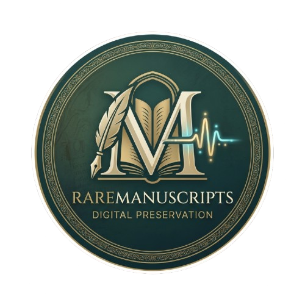

<p align="center">
  
</p>

<h1 align="center">
   RareManuscripts
</h1>

<p align="center">
  <strong>Digital Preservation Portal</strong>
</p>

<p align="center">
  A secure archive platform for cataloging, preserving, and researching fragile historical manuscripts without risking the physical originals.
</p>

<p align="center">
  
  
  
  
  
  
</p>

<br>

<p align="center">
  <em>
    SoftUni Spring Advanced — Exam Project · June 2026
  </em>
</p>

##  Overview

**RareManuscripts** is a digital preservation portal designed for cultural institutions, archives, and researchers.

The system allows:

- 🏛️ **Institutions** to digitally catalog and manage historical manuscripts
- 🔐 **Researchers** to request controlled access to protected materials
- 📝 **Researchers** to maintain private study notes
- 📅 **Visitors** to reserve reading-room sessions
- 👩‍🏫 **Curators** to manage manuscripts and approve access
- 🛡️ **Administrators** to manage user roles

The goal is simple:

> Preserve the physical manuscript while providing secure digital access to researchers.

---

# Live Demo

| Service | URL |
|---|---|
| Frontend | `raramanuscripts.netlify.app` |
| Main API | `https://spring-advanced-exam-2026-2.onrender.com` |
| Digitization Service | `https://spring-advanced-exam-2026-1.onrender.com` |
| Email Service | `https://spring-advanced-exam-2026.onrender.com` |
| Database | MySQL on Aiven |

> ⚠️ **Note for exam evaluation**
>
> Backend services run on Render's free tier and may enter sleep mode after inactivity.
>
> The first request can take **1–2 minutes** while services wake up.
>
> If the application appears slow initially, please wait and retry.

---

# Architecture

RareManuscripts follows a **microservice architecture** with independently deployable services.

```
                         Browser
                            |
                            |
                            ▼
                    ┌───────────────┐
                    │   Frontend    │
                    │ React + Vite  │
                    └───────┬───────┘
                            |
                         REST + JWT
                            |
                            ▼
                    ┌───────────────┐
                    │   Main App    │
                    │ Spring Boot   │
                    │     :8080     │
                    └─────┬───┬─────┘
                          │   │
              Feign Client│   │Cache
                          │   │
                          ▼   ▼
              ┌────────────┐ ┌────────┐
              │Digitization│ │ Redis  │
              │  Service   │ └────────┘
              │   :8081    │
              └─────┬──────┘
                    │
                    ▼
             MySQL digitization_db


                    │
                    ▼

             Email Service
                Node.js
                :3001

                    │

                    ▼

             MySQL raremanuscripts_db
```

---

# Services

## Main Application

**Spring Boot REST API**

Responsible for:

- Authentication & authorization
- JWT security
- Google OAuth2 login
- Manuscript catalog
- Access requests
- Reading-room reservations
- Study notes
- User management
- Admin functionality

---

## Digitization Service

**Independent Spring Boot microservice**

Handles:

- Digitization job creation
- Processing status tracking
- Manuscript digitization workflow

Communication:

```
main-app
   |
   | OpenFeign
   |
digitization-service
```

The service owns its own database.

---

## Email Service

**Node.js microservice**

Provides:

- Transactional emails
- Access request notifications
- User communication

Uses:

- Resend API

---

## Frontend

**React 18 SPA**

Built with:

- Vite
- React Router
- Axios

Features:

- Role-based UI
- Authentication flow
- Manuscript browsing
- Research workflow
- Admin panels

---

# User Roles

| Role | Permissions |
|---|---|
| 🔎 Researcher | Browse manuscripts, request access, create notes, reserve reading slots |
| 🏛️ Curator | Manage manuscripts, approve requests, manage reservations, start digitization |
| 🛡️ Admin | All permissions + user role management |

---

# Tech Stack

## Backend

- Java 21
- Spring Boot
- Spring Security
- JWT Authentication
- Google OAuth2
- Spring Data JPA
- Spring Cloud OpenFeign
- Spring Cache
- Redis
- Spring Scheduling
- AOP

## Frontend

- React 18
- Vite
- React Router
- Axios

## Services

- Node.js
- Resend API
- Groq API

## Infrastructure

- Docker
- Docker Compose
- Netlify
- Render
- Aiven MySQL

---

# Running Locally

## Requirements

Only:

- Docker
- Docker Compose

No local installation of:

- Java
- Node.js
- MySQL
- Redis

is required.

---

## 1. Clone repository

```bash
git clone https://github.com/zlatvv/Spring-Advanced-Exam-2026.git

cd Spring-Advanced-Exam-2026
```

---

## 2. Configure environment variables

Create:

```
.env
```

in the project root.

Example:

```env
# Database
DB_USERNAME=root
DB_PASSWORD=change-me


# Authentication
JWT_SECRET=change-me-to-a-long-random-string
JWT_EXPIRATION_MS=86400000

GOOGLE_CLIENT_ID=your-google-client-id
GOOGLE_CLIENT_SECRET=your-google-client-secret


# Services

DIGITIZATION_SERVICE_URL=http://digitization-service:8081

EMAIL_SERVICE_URL=http://email-service:3001

FRONTEND_URL=http://localhost


# Redis

REDIS_HOST=redis
REDIS_PORT=6379


# Frontend

VITE_API_URL=http://localhost:8080/api

VITE_GOOGLE_OAUTH_URL=http://localhost:8080/oauth2/authorization/google


# AI

GROQ_API_KEY=your-key


# Email

RESEND_API_KEY=your-key


# Seed Admin

SEED_ADMIN_NAME=Admin

SEED_ADMIN_EMAIL=admin@raremanuscripts.local

SEED_ADMIN_PASSWORD=change-me
```

---

## 3. Start the application

```bash
docker compose up --build
```

Docker will start:

| Service | Port |
|---|---:|
| Frontend | `80` |
| Main API | `8080` |
| Digitization Service | `8081` |
| Email Service | `3001` |
| Redis | `6379` |
| MySQL | `3306` |

---

# Default Admin Account

On first startup an administrator account is created automatically.

Credentials are taken from:

```env
SEED_ADMIN_EMAIL
SEED_ADMIN_PASSWORD
```

Use this account to access:

- Admin dashboard
- User management
- Role management
- Curator functionality

---

# Testing Locally

After startup verify:

### Frontend

```
http://localhost
```

### Main API

```
http://localhost:8080
```

### Digitization Service

```
http://localhost:8081
```

### Email Service

```
http://localhost:3001
```

---

# Security

Implemented:

✅ JWT authentication  
✅ Google OAuth2 login  
✅ Role-based authorization  
✅ Protected API endpoints  
✅ Secure service communication  
✅ Separate databases per service  

---

# AI Integration

RareManuscripts includes AI-assisted functionality powered by:

**Groq API**

Used for:

- LLM-assisted archive features
- Research support functionality

---

# Database Design

The system uses separated databases:

```
raremanuscripts_db
        |
        |
    main-app data


digitization_db
        |
        |
digitization-service data
```

Benefits:

- Service independence
- Clear ownership of data
- Easier scaling
- Microservice isolation

---

# Project Highlights

⭐ Microservice architecture  
⭐ Independent service deployment  
⭐ JWT + OAuth2 authentication  
⭐ Role-based access control  
⭐ Redis caching  
⭐ AI-assisted functionality  
⭐ Dockerized development environment  
⭐ Cloud deployment ready  

---

# Author

**Zlatev**

SoftUni Spring Advanced — June 2026

---
